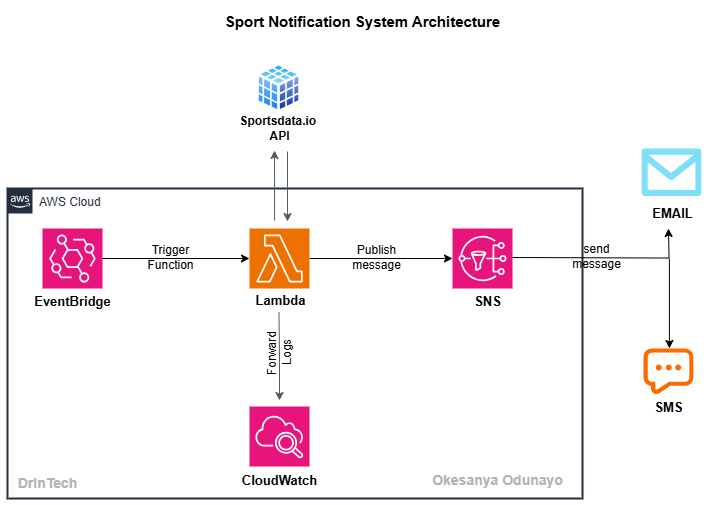
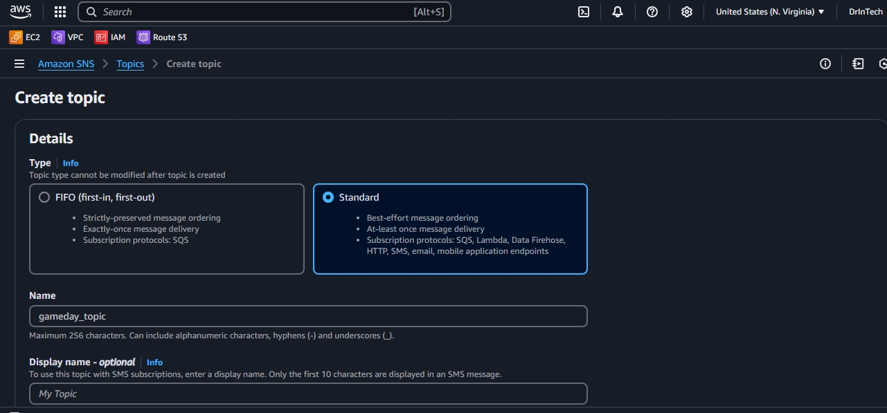
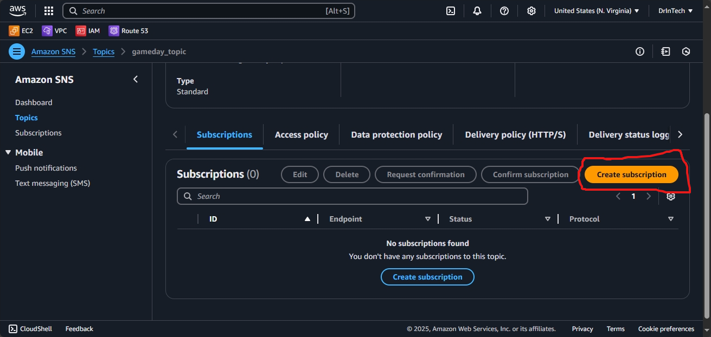
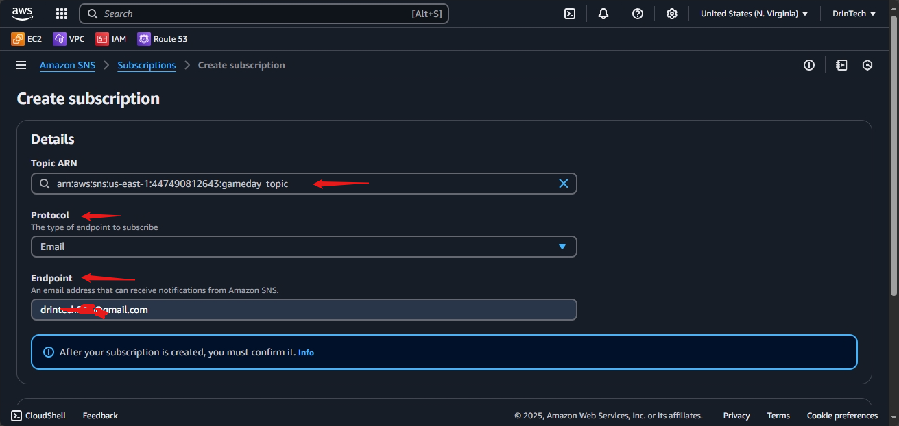
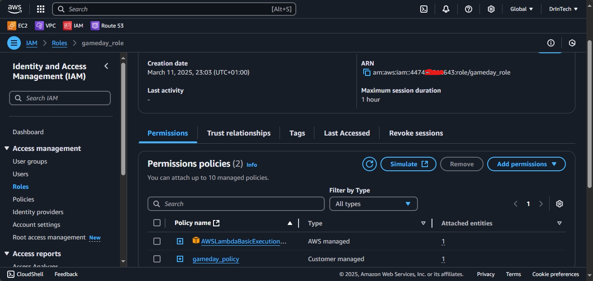
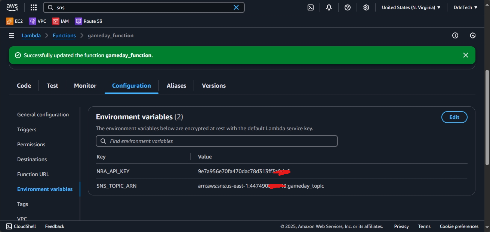
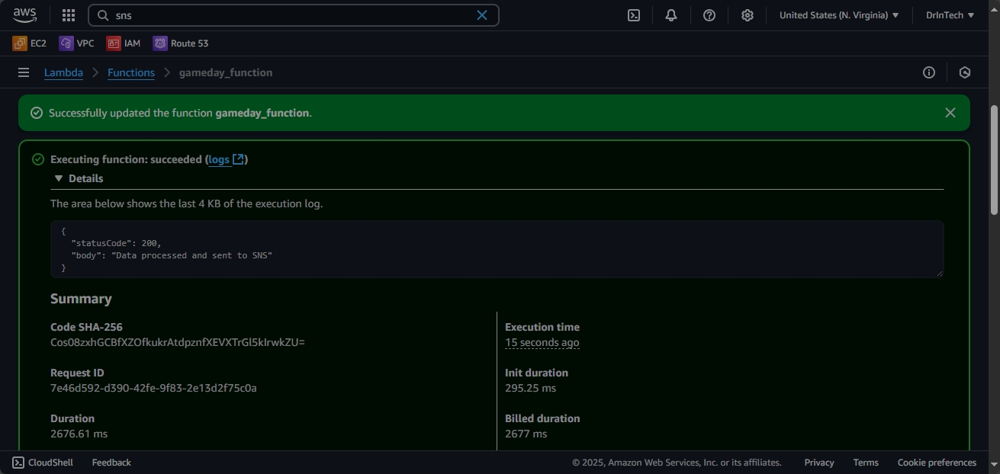
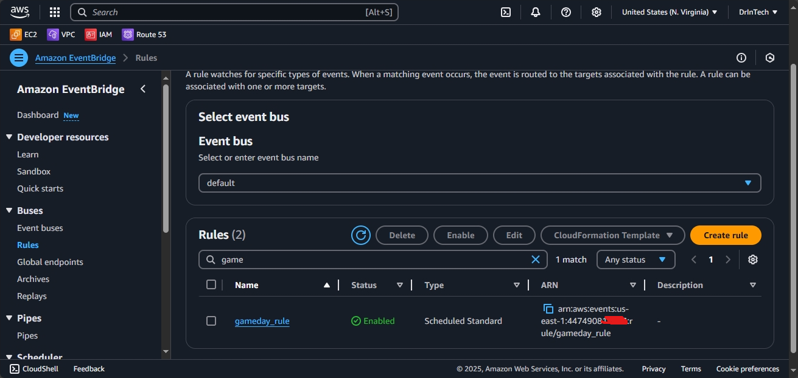
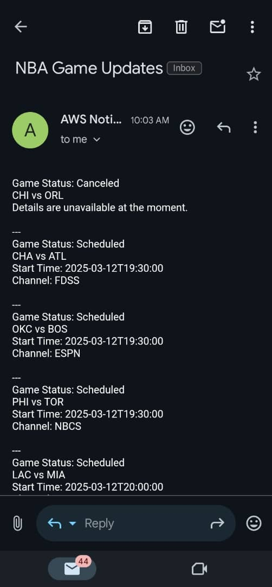
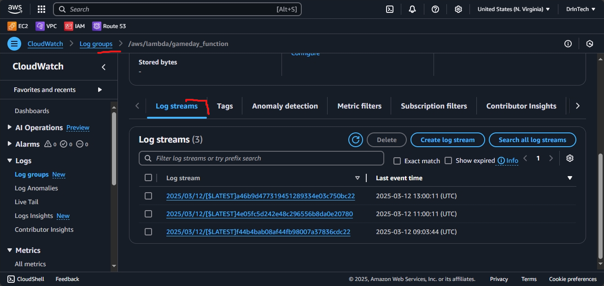

# NBA Game Day Notifications / Sports Alerts System

## **Project Overview**
This project is an alert system that sends real-time NBA game day score notifications to subscribed users via SMS/Email. It leverages **Amazon SNS**, **AWS Lambda and Python**, **Amazon EventBridge** and **NBA APIs** to provide sports fans with up-to-date game information. The project demonstrates cloud computing principles and efficient notification mechanisms.

---

## **Features**
- Fetches live NBA game scores using an external API.
- Sends formatted score updates to subscribers via SMS/Email using Amazon SNS.
- Scheduled automation for regular updates using Amazon EventBridge.
- Designed with security in mind, following the principle of least privilege for IAM roles.

## **Prerequisites**
- Free account with subscription and API Key at [sportsdata.io](https://sportsdata.io/)
- Personal AWS account with basic understanding of AWS and Python

---

## **Technical Architecture**



---


## **Technologies**
- **Cloud Provider**: AWS
- **Core Services**: SNS, Lambda, EventBridge
- **External API**: NBA Game API (SportsData.io)
- **Programming Language**: Python 3.x
- **IAM Security**:
  - Least privilege policies for Lambda, SNS, and EventBridge.

---

## **Summary on Core Services**
1. **EventBridge** is a serverless event bus that routes events from different aws services or custom applications. In summary it receives events, routes events based on rules, and trigger targets.
2. **Lambda** is a serverless compute services that runs code in response to events.
3. **SNS** is a publish-subscribe (pub/sub) messaging service. Publishers (e.g Lambda function) sends messages to an sns topic. Subscribers (sms, endpoints) receive notifications when a message is published.

## **Project Structure**
```bash
game-day-notifications/
├── src/
│   └── gd_notifications.py          # Main Lambda function code
├── policies/
│   └── gb_sns_policy.json           # SNS publishing permissions
│   
│       
├── .gitignore
└── README.md                        # Project documentation
```

## **Setup Instructions**

### **Clone the Repository**
```bash
git clone https://github.com/ifeanyiro9/game-day-notifications.git
cd game-day-notifications
```

### **Create an SNS Topic**
1. Open the AWS Management Console.
2. Navigate to the SNS service.
3. Click Create Topic and select Standard as the topic type.

4. Name the topic (e.g., gd_topic) and note the ARN.
5. Click Create Topic.

### **Add Subscriptions to the SNS Topic**
1. After creating the topic, click on the topic name from the list.
2. Navigate to the Subscriptions tab and click Create subscription.

3. Select a Protocol:
- For Email:
  - Choose Email.
  - Enter a valid email address.
- For SMS (phone number):
  - Choose SMS.
  - Enter a valid phone number in international format (e.g., +1234567890).



4. Click Create Subscription.
5. If you added an Email subscription:
- Check the inbox of the provided email address.
- Confirm the subscription by clicking the confirmation link in the email.
6. For SMS, the subscription will be immediately active after creation.

### **Create the SNS Publish Policy**
1. Open the IAM service in the AWS Management Console.
2. Navigate to Policies → Create Policy.
3. Click JSON and paste the JSON policy from gameday_sns_policy.json file

```
{
    "Version": "2012-10-17",
    "Statement": [
        {
            "Effect": "Allow",
            "Action": "sns:Publish",
            "Resource": "arn:aws:sns:REGION:ACCOUNT_ID:gameday_topic"
        }
    ]
}

```
4. Replace REGION and ACCOUNT_ID with your AWS region and account ID.
5. Click Next: Tags (you can skip adding tags).
6. Click Next: Review.
7. Enter a name for the policy (e.g., gd_sns_policy).
8. Review and click Create Policy.

### **Create an IAM Role for Lambda**
1. Open the IAM service in the AWS Management Console.
2. Click Roles → Create Role.
3. Select AWS Service and choose Lambda.
4. Attach the following policies:
- SNS Publish Policy (gameday_policy) (created in the previous step).
- Lambda Basic Execution Role (AWSLambdaBasicExecutionRole) (an AWS managed policy).


5. Click Next: Tags (you can skip adding tags).
6. Click Next: Review.
7. Enter a name for the role (e.g., gameday_role).
8. Review and click Create Role.
9. Copy and save the ARN of the role for use in the Lambda function.

### **Deploy the Lambda Function**
1. Open the AWS Management Console and navigate to the Lambda service.
2. Click Create Function.
3. Select Author from Scratch.
4. Enter a function name (e.g., gameday_notifications).
5. Choose Python 3.x as the runtime.
6. Assign the IAM role created earlier (gameday_role) to the function.
7. Under the Function Code section:
- Copy the content of the src/gd_notifications.py file from the repository.
- Paste it into the inline code editor.
8. Under the Environment Variables section, add the following:
- NBA_API_KEY: your NBA API key.
- SNS_TOPIC_ARN: the ARN of the SNS topic created earlier.


9. Click Create Function.
10. Go to the Test tab and click 'test' to test the function. Verify that SMS notifications are sent to the subscribed users.



### **Set Up Automation with Eventbridge**
1. Navigate to the Eventbridge service in the AWS Management Console.
2. Go to Rules → Create Rule.
3. Select Event Source: Schedule.
4. Set the cron schedule for when you want updates (e.g., hourly).
```
cronjob for eventbridge
0  9-23/2,0-2/2,  *  , *   ,  ?  ,  *
```
The above job runs every 2 hours from 9am-2am the next day. “?” is a placeholder for days of the week.
5. Under Targets, select the Lambda function (gameday_function) and save the rule.


6. Verify that email/sms notifications are sent to the subscribed users.


7. Inspect cloudwatch for the lambda function log streams.



